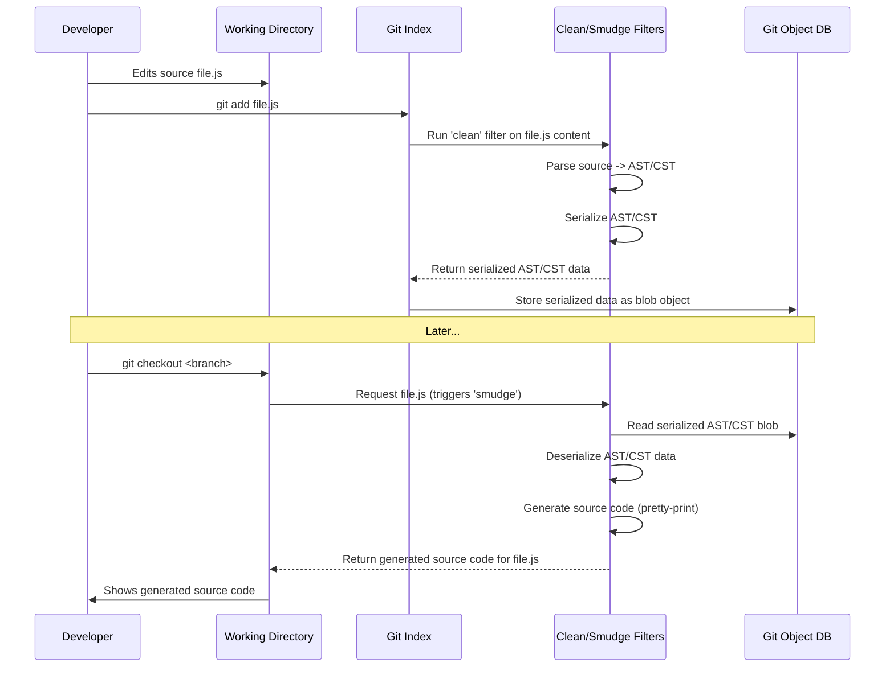
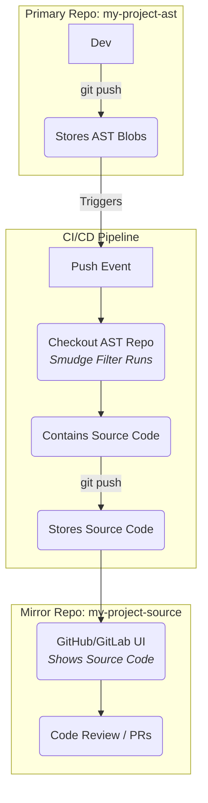

# Git Clean/Smudge Filter Pipeline for ASTs

This document details how `git-ast` utilizes Git's clean/smudge filter mechanism to store Abstract Syntax Trees (ASTs) or Concrete Syntax Trees (CSTs) instead of source code directly in the repository.

## Overview

The core idea is to transform source code files into their AST/CST representations when they are added to the Git index (the "clean" process) and transform them back into source code when they are checked out into the working directory (the "smudge" process).



This approach keeps the developer's interaction with standard source files while storing a canonical structural representation within Git.

## Configuration

Setting this up requires configuration in two places:

### 1. `.gitattributes`

This file, typically at the root of your repository, tells Git *which* files should be processed by our filter.

**Example:**

```gitattributes
# Apply the 'ast' filter to all JavaScript files
*.js filter=ast

# Example for Python files
# *.py filter=ast

# Example for TypeScript files
# *.ts filter=ast
```

The `filter=ast` attribute instructs Git to use the filter named "ast" for matching files.

### 2. Git Configuration (`.git/config` or global config)

This defines *what* the "ast" filter actually does by specifying the commands for the clean and smudge operations. This configuration usually goes in the repository-specific `.git/config` file.

**Example:**

```ini
[filter "ast"]
    # Command to run when staging a file (source -> AST)
    clean = ./scripts/encode-to-ast

    # Command to run when checking out a file (AST -> source)
    smudge = ./scripts/decode-from-ast

    # Crucial: Treat filter failures as errors
    required = true
```

-   `clean`: Specifies the script/command that takes source code on `stdin` and outputs the serialized AST/CST on `stdout`.
-   `smudge`: Specifies the script/command that takes the serialized AST/CST from the Git object database on `stdin` and outputs reconstructed source code on `stdout`.
-   `required = true`: Ensures Git aborts the operation (e.g., `git add`, `git checkout`) if the filter fails, preventing data corruption.

## Filter Scripts (`encode-to-ast`, `decode-from-ast`)

You need to implement these scripts (or compiled executables).

### `encode-to-ast` (Clean Script)

-   **Input:** Source code text via `stdin`.
-   **Action:**
    1.  Parse the input code into an AST/CST (e.g., using Tree-sitter).
    2.  Serialize the resulting AST/CST structure into a defined format (e.g., JSON, MessagePack, CBOR, S-expressions). Include necessary information like comments.
-   **Output:** Serialized AST/CST data via `stdout`.

**Pseudo-code Example:**

```python
# Example: encode-to-ast (conceptual)
import sys
from tree_sitter_language import parser # Hypothetical parser
import json # Or other serialization library

source_code = sys.stdin.read()
try:
    tree = parser.parse(bytes(source_code, "utf8"))
    # Extract relevant data from 'tree' (a Tree-sitter CST)
    ast_representation = convert_ts_to_serializable(tree) # Your conversion logic
    serialized_data = json.dumps(ast_representation)
    sys.stdout.write(serialized_data)
except Exception as e:
    print(f"Error parsing/serializing: {e}", file=sys.stderr)
    sys.exit(1) # Signal failure
```

### `decode-from-ast` (Smudge Script)

-   **Input:** Serialized AST/CST data via `stdin`.
-   **Action:**
    1.  Deserialize the input data back into an in-memory AST/CST representation.
    2.  Generate formatted source code from the AST/CST (pretty-printing). This should ideally be deterministic.
-   **Output:** Generated source code text via `stdout`.

**Pseudo-code Example:**

```python
# Example: decode-from-ast (conceptual)
import sys
import json # Or other serialization library
from my_pretty_printer import generate_code # Hypothetical code generator

serialized_data = sys.stdin.read()
try:
    ast_representation = json.loads(serialized_data)
    # Reconstruct internal AST if needed
    # reconstructed_ast = build_ast_from_data(ast_representation)
    source_code = generate_code(ast_representation) # Your generation logic
    sys.stdout.write(source_code)
except Exception as e:
    print(f"Error deserializing/generating: {e}", file=sys.stderr)
    sys.exit(1) # Signal failure
```

These scripts must be executable and accessible from the path specified in the Git configuration.

## Performance Considerations

Applying filters introduces overhead compared to standard Git operations:

-   **Parsing/Generation Cost:** Converting between text and AST/CST takes CPU time, especially for large files or complex languages.
-   **Process Startup:** Invoking separate `clean`/`smudge` processes for every file can be slow, particularly in repositories with thousands of tracked files.

**Mitigation Strategies:**

1.  **Long-Running Process Filters:** Configure Git to use a persistent filter process instead of invoking a script per file. This drastically reduces process startup overhead.
    ```ini
    [filter "ast"]
        process = ./scripts/ast-filter-daemon # Your long-running filter daemon
        required = true
    ```
    The daemon script must implement Git's specific [long-running filter protocol](https://git-scm.com/docs/gitattributes#_long_running_filter_process).

2.  **Efficient Serialization:** Use compact and fast binary formats (e.g., MessagePack, CBOR, Protocol Buffers) instead of text-based ones like JSON for serializing ASTs/CSTs.

3.  **Optimized Parsing/Generation:** Ensure the core parsing (Tree-sitter is generally fast) and code generation (pretty-printing) logic is efficient.

4.  **Caching:** Implement caching within the filter process/daemon if identical content is frequently processed (though Git's hashing often mitigates this at the object level).

## Integration with Platforms (e.g., GitHub, GitLab)

This is a critical limitation to understand: **Remote platforms like GitHub do not run your local clean/smudge filters.** They interact directly with the raw blob objects stored in the Git repository.

Since `git-ast` stores *serialized AST/CST data* as blobs, this means:

-   **Web UI:** Browsing files on GitHub will show the raw serialized AST/CST data, not human-readable source code.
-   **Diffs:** Diffs generated by the platform (e.g., in Pull Requests) will compare the serialized AST/CST data, which is likely meaningless for code review.
-   **Pull Requests:** Merging PRs via the web UI might operate on the serialized data, bypassing the `smudge` filter and potentially leading to corrupted results if merge conflicts are resolved manually in the serialized format.

### Workaround: Mirrored Repository via CI/CD

A viable strategy for collaboration on platforms is to maintain two repositories:

1.  **`my-project-ast` (Primary/Development):**
    -   Uses the clean/smudge filters.
    -   Stores AST/CST blobs.
    -   Developers work here with correctly configured local Git environments.
2.  **`my-project-source` (Mirror/Collaboration):**
    -   Stores standard source code ("smudged" content).
    -   Used for code browsing, pull requests, and CI/CD on platforms like GitHub.

**Automation:**

Set up a CI/CD pipeline (e.g., GitHub Actions, GitLab CI) in the `my-project-ast` repository:
-   **Trigger:** On every push to the primary repository (`my-project-ast`).
-   **Action:**
    1.  The CI runner checks out the code. The checkout process automatically triggers the `smudge` filter, generating the source code in the runner's workspace.
    2.  The CI job then pushes the generated source code files to the `my-project-source` repository.



This keeps the benefits of AST-based storage for local development while providing a standard source code view for collaboration platforms.

## Other Potential Customizations

The filter mechanism can be complemented by other Git customizations:

-   **Custom Diff Driver:** Configure Git to use a specific script for generating diffs, potentially comparing ASTs semantically instead of text lines.
    ```gitattributes
    *.js diff=ast
    ```
    ```ini
    [diff "ast"]
        command = ./scripts/ast-diff # Script takes paths, outputs diff
    ```
-   **Custom Merge Driver:** Implement a merge driver that operates on the AST/CST level to perform more intelligent, syntax-aware merges.
    ```gitattributes
    *.js merge=ast
    ```
    ```ini
    [merge "ast"]
        name = AST merge driver
        driver = ./scripts/ast-merge %O %A %B # %O=base, %A=ours, %B=theirs
    ```

These require implementing the respective `ast-diff` and `ast-merge` scripts, which involve significant challenges like tree differencing and structural conflict resolution.

## Filters for Compression

While filters *could* be used to apply additional compression (e.g., LZ4, Zstd) on top of Git's built-in zlib compression, this is generally **not recommended** for AST/CST storage. The added complexity and processing overhead during clean/smudge usually outweigh the marginal benefits, especially if an efficient binary serialization format is already used for the AST/CST data. Git's delta compression on the blobs often provides sufficient size reduction. 
