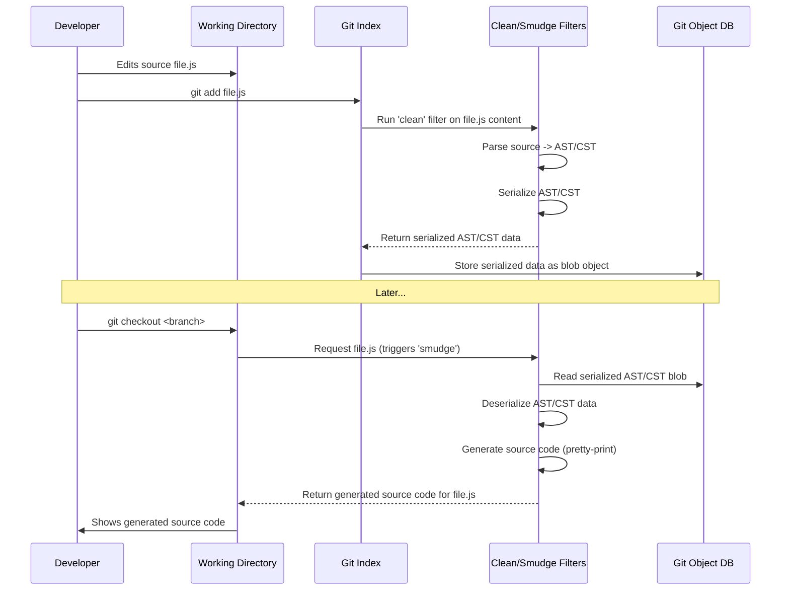
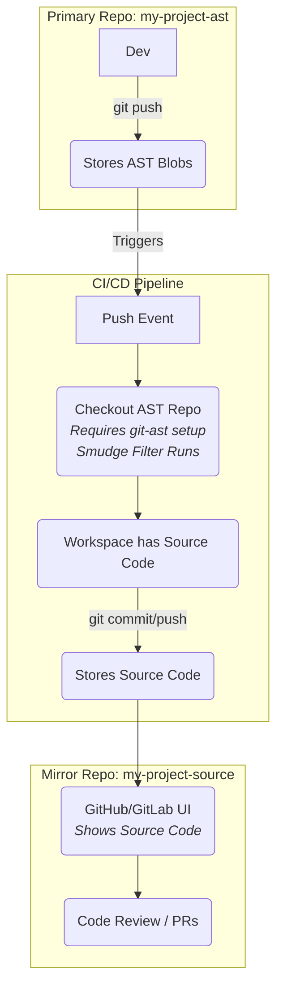

# Git Clean/Smudge Filter Pipeline for ASTs

This document details how `git-ast` utilizes Git's clean/smudge filter mechanism to store Abstract Syntax Trees (ASTs) or Concrete Syntax Trees (CSTs) instead of source code directly in the repository.

## Overview

The core idea is to transform source code files into their AST/CST representations when they are added to the Git index (the "clean" process) and transform them back into source code when they are checked out into the working directory (the "smudge" process).



This approach keeps the developer's interaction with standard source files while storing a canonical structural representation within Git.

## Configuration

Setting this up requires configuration in two places:

### 1. `.gitattributes`

This file, typically at the root of your repository, tells Git _which_ files should be processed by our filter.

**Example:**

```gitattributes
# Apply the 'ast' filter to all JavaScript files
*.js filter=ast

# Example for Python files
# *.py filter=ast

# Example for TypeScript files
# *.ts filter=ast
```

The `filter=ast` attribute instructs Git to use the filter named "ast" for matching files.

### 2. Git Configuration (`.git/config` or global config)

This defines _what_ the "ast" filter actually does by specifying the commands for the clean and smudge operations. This configuration usually goes in the repository-specific `.git/config` file. Recommended setup uses the `git-ast` executable itself.

**Example using `git-ast` process:**

```ini
[filter "ast"]
    # Command for Git to invoke for clean/smudge
    # Uses the long-running process protocol for efficiency
    process = git-ast filter-process
    # Crucial: Treat filter failures as errors
    required = true
```

- `process = git-ast filter-process`: Specifies that Git should start the `git-ast` tool with the `filter-process` argument. This single process handles multiple files efficiently using Git's long-running filter protocol (see below).
- `required = true`: Ensures Git aborts the operation (e.g., `git add`, `git checkout`) if the `git-ast filter-process` command fails or exits unexpectedly.

(Alternatively, one could configure separate `clean = ...` and `smudge = ...` commands pointing to specific scripts or `git-ast` subcommands, but the `process` approach is generally preferred for performance.)

## Core Filter Components (Conceptual)

The `git-ast filter-process` command needs to orchestrate several key technical components:

### Long-Running Process Protocol Handler

- **Purpose:** Manages communication with the parent Git process over stdin/stdout.
- **Functionality:**
  - Performs initial handshake (advertising `clean` and `smudge` capabilities).
  - Enters a loop reading requests from Git.
  - For each request:
    - Parses command (`clean` or `smudge`), pathname, and potentially other metadata.
    - Reads the full file content sent by Git.
    - Dispatches to the appropriate clean or smudge logic.
    - Writes the status (`success`, `error`, `abort`) and resulting content back to Git.
  - Handles protocol details like packet framing and termination.

### `clean` Operation Components

- **Input:** Source code text (from Git via protocol handler), pathname.
- **Output:** Serialized AST/CST data (sent to Git via protocol handler).
- **Required Sub-components:**
  1.  **Parser:** Takes source code bytes and the language (derived from pathname or config) and produces an in-memory AST/CST representation. Must handle comments and potentially preserve positional information if needed for advanced features. (e.g., leveraging a Tree-sitter library).
  2.  **Serializer:** Takes the in-memory AST/CST and converts it into a defined byte format (e.g., MessagePack, CBOR, custom binary format, JSON). This format is what gets stored in Git.
- **Error Handling:** Must reliably report parsing or serialization failures back via the protocol handler (e.g., `status=error`).

### `smudge` Operation Components

- **Input:** Serialized AST/CST data (from Git via protocol handler), pathname.
- **Output:** Generated source code text (sent to Git via protocol handler).
- **Required Sub-components:**
  1.  **Deserializer:** Takes the serialized byte data (matching the format used by the `clean` serializer) and reconstructs the in-memory AST/CST representation.
  2.  **Pretty-Printer/Code Generator:** Takes the in-memory AST/CST and generates formatted source code text. This process should be deterministic (same AST always yields same text) to ensure consistency. (e.g., using a code formatting library or custom generation logic).
- **Error Handling:** Must reliably report deserialization or code generation failures back via the protocol handler.

## Performance Considerations

Applying filters introduces overhead compared to standard Git operations:

- **Parsing/Generation Cost:** Converting between text and AST/CST takes CPU time, especially for large files or complex languages.
- **Serialization/Deserialization Cost:** The efficiency of the chosen serialization format and library impacts performance.
- **Process Startup:** (Mitigated by using the `process` configuration and long-running filter protocol).

**Mitigation Strategies (Focus Areas):**

1.  **Use Long-Running Process:** Essential for avoiding per-file startup cost. The `git-ast filter-process` must correctly implement this protocol.
2.  **Choose Efficient Serialization:** Binary formats (MessagePack, CBOR, Protocol Buffers) are generally faster and more compact than text formats (JSON).
3.  **Optimize Core Logic:** Ensure the parsing (Tree-sitter is typically fast), serialization/deserialization, and code generation components are implemented efficiently.
4.  **Consider Caching:** The filter process could potentially cache results (e.g., parsed ASTs, generated code) based on content hashes if identical inputs are common, although careful implementation is needed to ensure correctness.

## Integration with Platforms (e.g., GitHub, GitLab)

This is a critical limitation to understand: **Remote platforms like GitHub do not run your local clean/smudge filters.** They interact directly with the raw blob objects stored in the Git repository.

Since `git-ast` stores _serialized AST/CST data_ as blobs, this means:

- **Web UI:** Browsing files on GitHub will show the raw serialized AST/CST data, not human-readable source code.
- **Diffs:** Diffs generated by the platform (e.g., in Pull Requests) will compare the serialized AST/CST data, which is likely meaningless for code review.
- **Pull Requests:** Merging PRs via the web UI might operate on the serialized data, bypassing the `smudge` filter and potentially leading to corrupted results if merge conflicts are resolved manually in the serialized format.

### Workaround: Mirrored Repository via CI/CD

A viable strategy for collaboration on platforms is to maintain two repositories:

1.  **`my-project-ast` (Primary/Development):**
    - Uses the clean/smudge filters.
    - Stores AST/CST blobs.
    - Developers work here with correctly configured local Git environments.
2.  **`my-project-source` (Mirror/Collaboration):**
    - Stores standard source code ("smudged" content).
    - Used for code browsing, pull requests, and CI/CD on platforms like GitHub.

**Automation (CI/CD Technology Needed):**

Requires a CI/CD pipeline (e.g., GitHub Actions, GitLab CI) configured in the `my-project-ast` repository:

- **Trigger:** On pushes to the primary repository.
- **Action:**
  1.  **Checkout:** The CI runner checks out the code from `my-project-ast`. This _must_ occur in an environment where the `git-ast` filter is correctly configured and executable, so the checkout process triggers the `smudge` filter.
  2.  **Generate Source:** The result of the checkout in the CI workspace is the generated source code.
  3.  **Commit & Push:** The CI job commits these source files to a local clone of the `my-project-source` repository and pushes the changes.



This architecture keeps the benefits of AST-based storage locally while enabling standard workflows on remote platforms.

## Other Potential Customizations

The filter mechanism can be complemented by other Git customizations, requiring corresponding subcommands in `git-ast`:

- **Custom Diff Driver (`git-ast diff-driver`):**
  - **Config:** `[diff "ast"] command = git-ast diff-driver`
  - **Technology:** Requires AST/CST parsing, tree-differencing algorithms (e.g., GumTree), and diff formatting logic.
  - **Function:** Compares two versions structurally and outputs a semantic diff.
- **Custom Merge Driver (`git-ast merge-driver`):**
  - **Config:** `[merge "ast"] driver = git-ast merge-driver %O %A %B ...`
  - **Technology:** Requires AST/CST parsing, 3-way tree merging algorithms, conflict detection/marking strategies, and code generation.
  - **Function:** Merges three versions structurally, potentially auto-resolving conflicts or marking them in the output file.

Implementing these drivers involves significant technical challenges beyond the basic filter pipeline.

## Filters for Compression

While filters _could_ technically add another layer of compression, this is generally **not recommended** for AST/CST storage.

- **Complexity:** Adds another step to both clean and smudge.
- **Diminishing Returns:** If an efficient binary serialization is used for the AST/CST, further general-purpose compression might offer limited gains, especially considering Git's built-in zlib and delta compression on blobs.
- **Performance Cost:** The overhead of compression/decompression on every filter invocation likely outweighs the benefits.
